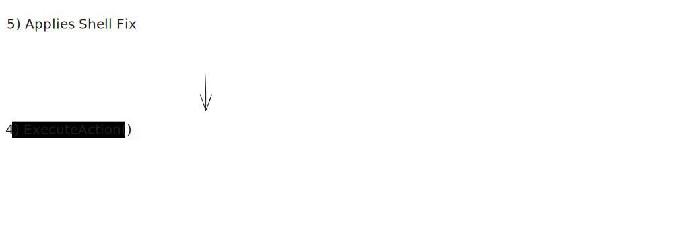

# Project Sentinel: Autonomous Self-Healing Infrastructure

> **A high-performance distributed system bridging Go-based system monitoring with Gemini-powered agentic reasoning to automate incident response.**

---

## 🏗️ System Architecture

The system follows a **"Muscle & Brain"** architecture, decoupling low-level system execution from high-level cognitive reasoning.

## 🚀 Technical Highlights

- Polyglot Microservices: Leveraged Go for high-concurrency system monitoring and Python for complex LLM orchestration, ensuring optimal performance for both tasks.
- Low-Latency Communication: Implemented gRPC (Protocol Buffers) to provide a type-safe, bi-directional communication layer between the monitoring "Muscle" and the reasoning "Brain."
- Agentic Self-Correction: Built a stateful reasoning loop using LangGraph. If an initial fix (e.g., systemctl restart) fails, the agent analyzes the stderr and pivots to alternative recovery strategies.
- Safety-First Execution: Engineered a Command Policy Engine in the Go binary that sanitizes and validates AI-generated shell commands against a whitelist prior to execution.

## 🛠️ Tech Stack

- Languages: Go (Golang), Python 3.10+
- Communication: gRPC, Protocol Buffers (v3)
- Intelligence: Google Gemini 2.5 Flash, LangGraph, LangChain
- Environment: WSL2 (Ubuntu 22.04), Docker

## 📂 Repository Structure

- /go-control-plane: The Muscle. Handles the gRPC server, system telemetry loops, and shell command execution.
- /python-brain: The Brain. Contains the gRPC client, LangGraph state machine logic, and LLM tool-calling definitions.
- /proto: The Contract. Shared .proto definitions ensuring schema consistency across both services.
