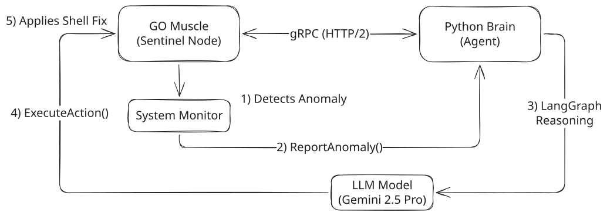

# Project Sentinel: Autonomous Self-Healing Infrastructure

A distributed system that bridges Go-based infrastructure monitoring with Gemini-powered agentic reasoning to automate incident detection and recovery.

---

## System Architecture

The system follows a "Muscle and Brain" architecture, decoupling low-level system execution from high-level cognitive reasoning.



The Go Muscle runs continuously, performing health checks against monitored services and streaming anomaly events to the Python Brain over gRPC. The Brain feeds each event into a LangGraph reasoning loop backed by Gemini 2.5 Flash, which decides on a fix, calls back to the Muscle via the `ExecuteAction` RPC, and retries if the first attempt fails. All commands are validated against a whitelist in the Go binary before execution.

---

## Technical Highlights

- **Polyglot services:** Go handles high-concurrency health monitoring and shell execution; Python handles LLM orchestration. Each language is used where it performs best.
- **Low-latency communication:** gRPC with Protocol Buffers provides a type-safe, bidirectional channel between the two services. The `StreamLogs` RPC is used as a push channel so the Brain receives anomalies instantly rather than polling.
- **Agentic self-correction:** The LangGraph state machine loops until the fix succeeds or the retry limit is reached. If an initial command is blocked or fails, the agent analyzes the response and tries an alternative.
- **Command policy engine:** The Go binary validates every AI-generated command against a regex whitelist before calling `os/exec`. Commands that do not match are rejected with a structured error before any execution occurs.

---

## Tech Stack

- **Languages:** Go 1.24, Python 3.10+
- **Communication:** gRPC, Protocol Buffers v3
- **Intelligence:** Google Gemini 2.5 Flash, LangGraph, LangChain
- **Infrastructure:** Docker Compose, WSL2 (Ubuntu 22.04)

---

## Repository Structure

```
sentinel/
  go-control-plane/   The Muscle. gRPC server, health checks, policy engine, os/exec.
  python_brain/       The Brain. gRPC client, LangGraph agent, Gemini tool-calling.
  proto/              Shared .proto contract between both services.
  nginx/              Nginx config for the Docker test environment.
  docker-compose.yml  Test services (nginx, redis) with health checks.
```

---

## Running Locally

Start the test services:
```bash
docker-compose up -d
```

Start the Go Muscle (terminal 1):
```bash
cd go-control-plane && go run .
```

Start the Python Brain (terminal 2):
```bash
cd python_brain && python main.py
```

Simulate a failure (terminal 3):
```bash
docker stop sentinel-nginx
```

The Muscle detects the failed health check within 5 seconds, pushes the anomaly to the Brain, and the Brain issues a `docker restart sentinel-nginx` command to restore the service.

---

## Tests

```bash
make test          # all suites
make test-go       # Go unit + integration (policy engine, health checks, gRPC handlers, E2E)
make test-python   # Python unit (tool, graph, anomaly parsing)
make test-e2e      # Python E2E simulation (mock Muscle + mock LLM, no API key required)
```

---

## License

MIT. See [LICENSE](LICENSE).
